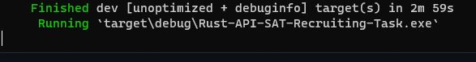
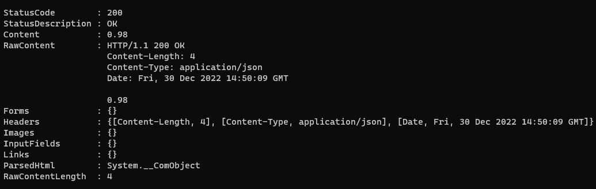

# Introduction

This project is solution of SAT recruiting task  made in Rust You can read about it here: [SAT Recruiting Task PDF](https://github.com/helter88/Rust-API-SAT-Recruiting-Task/blob/main/readme_files/junior_fullstack_task.pdf)

# Requirements to run project

You will need Rust installed on your computer. To do so you should visit [Rust Website](https://doc.rust-lang.org/book/ch01-01-installation.html)

# How to run project

1. Download repo from Github to one of your chosen folder.
2. Run Terminal and select your folder with downloaded project.
3. Write `cargo run` in your terminal and wait for compilation process. 
You should receive something like this: 

4. Now you can start making requests to API

# Example of request to API

1. Lets test the first endpoint of API, to do so you should open new terminal window and write: `curl "127.0.0.1:8080/calculateDisselUsageForDistance?distance=200&year_of_production=2007&fuel_usage_per_100km=10"`
You should receive something like this:

2. Lets test the second endpoint of API, to do so write in terminal: `curl "127.0.0.1:8080/probabilityOfUnitInjectorFail?vin=ABC123"`
You should receive something like this:

# Built using

- Rust
- Actix Web
- rand